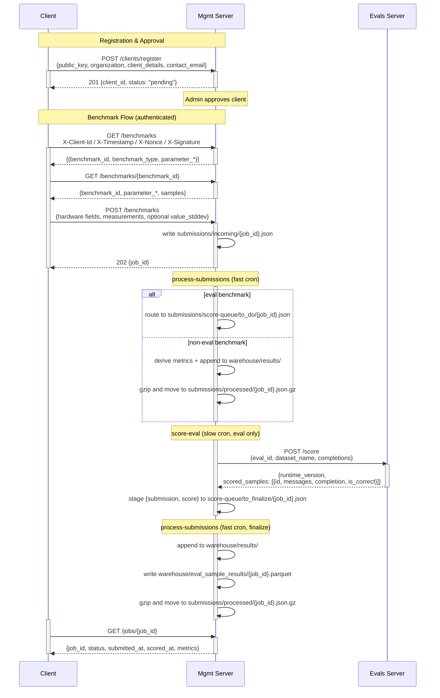
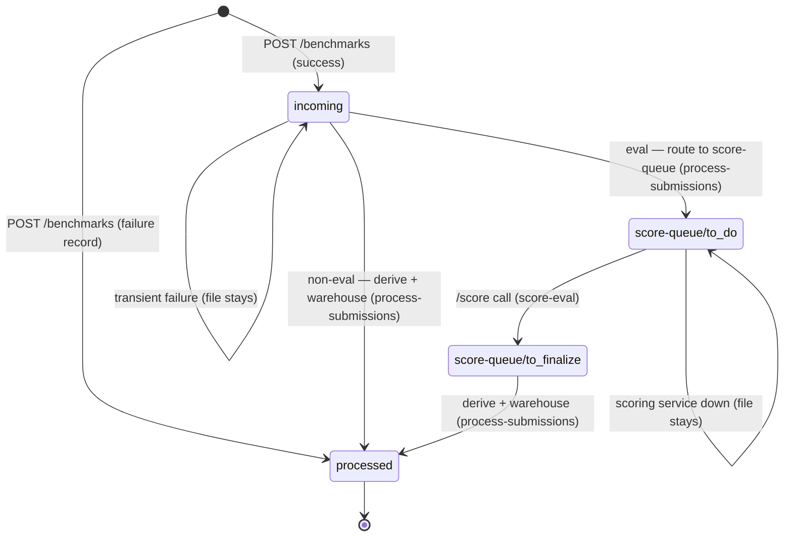

# pipette-mgmt

A thin Rust/axum HTTP service that manages benchmarks for edge devices. It serves
a benchmark catalog, accepts measurement submissions, scores eval completions via
the evals server, and writes processed results to Parquet.

## 1. Motivation

Edge devices run benchmarks (throughput, latency, accuracy) and submit results.
Eval-type benchmarks require server-side scoring which happens asynchronously.
This service decouples submission from scoring by writing results to disk and
processing them via a cron job.

Application code does not access storage layout directly. It goes through
separate storage domains:

- `CatalogStore` for benchmark definitions
- `AuthStore` for client identities (keys, registration data)
- `SubmissionStore` for incoming and processed submissions
- `WarehouseStore` for derived metric data
- `EvalSampleResultStore` for per-sample eval scoring outcomes

The implementation supports local filesystem and S3 backends, selected via
the `[storage]` config section. Auth data uses a dedicated backend
configured via the required `[auth_storage]` section.

## 2. Architecture

## 3. Processing lifecycle

The file's **location is its state** — there is no state field inside the
JSON. A submission's path tells you exactly where it is in the pipeline, and
`GET /jobs/{job_id}` maps that location to a `status` (`incoming`, `scoring`,
`processed`, or `failed`).

Which path a submission takes depends on its benchmark type. **Eval**
benchmarks need the multi-minute scoring-service `/score` call, so they
traverse the `score-queue/` and are handled by two cooperating crons.
**Non-eval** benchmarks (throughput, latency, memory, …) derive their metrics
locally, so they skip the queue and finish in a single fast pass.

### 3.1. Two crons

| Cron | Speed | Holds | Responsibility |
|---|---|---|---|
| `process-submissions` (alias `score`) | fast, frequent | `mutate` lock, briefly | Routes evals into the queue, scores non-evals inline, and finalizes scored evals into the warehouse. Never calls `/score`. |
| `score-eval` | slow | its own `score-eval` lock | Drains `score-queue/to_do/`, makes the `/score` call per eval, and stages the result into `score-queue/to_finalize/`. |

The two locks are independent: `score-eval`'s long `/score` calls never block
`process-submissions` (or `fix-*` / `requeue-eval`) from writing the warehouse,
and a second `score-eval` tick exits immediately rather than double-scoring.

### 3.2. Non-eval path (single pass)

1. `POST /benchmarks` (success) → `submissions/incoming/{job_id}.json` (status `incoming`).
2. `process-submissions` reads `incoming/`, derives metrics locally, and appends them to the target day partition under `warehouse/results/`.
3. On success: the submission is gzipped and moved to `submissions/processed/{job_id}.json.gz` (status `processed`).
4. On transient failure: the file stays in `incoming/` for retry on the next tick.

### 3.3. Eval path (staged through the score-queue)

1. `POST /benchmarks` (success) → `submissions/incoming/{job_id}.json` (status `incoming`).
2. `process-submissions` recognizes the eval and **routes** it: writes the same body to `submissions/score-queue/to_do/{job_id}.json`, then deletes the `incoming/` copy (status `scoring`). It does **not** call `/score`.
3. `score-eval` reads the `to_do` body, makes the `/score` call, and writes `{ submission, score }` to `submissions/score-queue/to_finalize/{job_id}.json`, then removes the `to_do` marker (still status `scoring`). This is the only stage where the body shape changes — the score response is wrapped alongside the submission.
4. `process-submissions` reads the `to_finalize` payload, derives metrics from the stored score (no further `/score` call), appends to `warehouse/results/`, and writes per-sample results to `warehouse/eval_sample_results/`.
5. On success: the bare submission is gzipped and moved to `submissions/processed/{job_id}.json.gz` (status `processed`); the `to_finalize` marker is removed.

Failure records (`message_type: "failure"`) bypass the pipeline entirely:
`POST /benchmarks` writes them straight to `submissions/processed/` (status
`failed`), since the scorer has nothing to do with them.

### 3.4. Idempotency

There is no atomic cross-store transaction on S3, so every hop is
**at-least-once + idempotent**: each step writes the next location *before*
deleting the previous one, so a crash leaves a duplicate-in-progress, never a
lost job. Specifically:

- A re-routed eval overwrites its `to_do` object (same content) and re-deletes `incoming/`.
- `score-eval` skips the `/score` call when a `to_finalize/{job_id}` entry already exists, so the expensive call is never repeated.
- The warehouse is append-only with last-wins-on-read (`max(scored_at)` per `job_id`), so re-finalizing a job writes fresh rows that supersede the old ones on read.

### 3.5. Output stores

`processed/` is an operational archive of accepted submissions.
`warehouse/results/` is the durable scored-results store for aggregate
metrics. `warehouse/eval_sample_results/` is the durable store for
per-sample eval outcomes.

`process-submissions` is the only writer for both `warehouse/results/`
and `warehouse/eval_sample_results/`; `score-eval` only ever writes the
`score-queue/` stages.

## 4. Evals server endpoints consumed

The mgmt server calls the following endpoints on the evals server (`evals_server_url`):

| Upstream endpoint | Mgmt trigger | Purpose |
|---|---|---|
| `POST /score` | `pipette-mgmt score-eval` | Score completions; response carries per-sample prompts, completions, verdicts, and scorer `runtime_version` |
| `GET /evals/{eval_id}/datasets/{dataset_name}/samples` | `GET /benchmarks/{benchmark_id}` (eval type) | Fetch prompts for clients to complete |

## 5. Reference

1. [authentication.md](authentication.md) — identity model, request signing, registration
2. [httpapi.md](httpapi.md) — endpoint documentation
3. [benchmarks.md](benchmarks.md) — benchmark catalog, payload schemas, Parquet columns
4. [storage.md](storage.md) — directory structure, submission file formats
5. [operations.md](operations.md) — configuration, running, cron setup
6. [cli.md](cli.md) — CLI reference, config schema, subcommands
7. [visualization.md](visualization.md) — exploring warehouse data
8. [development.md](development.md) — CI, sample data, contributing
9. [scoring-service.md](scoring-service.md) — scoring service contract (endpoints, request/response schemas)
