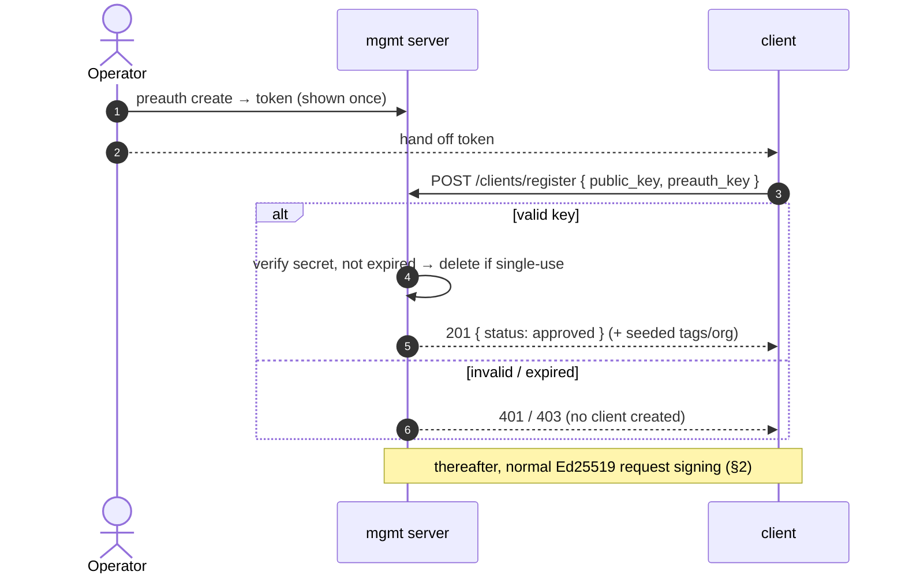

# Authentication

## 1. Identity model

Clients authenticate using Ed25519 keypairs — the private key is the only secret,
similar to WireGuard or SSH. There are no tokens, sessions, or passwords.

- **Private key** — stored on the client only. Never sent to the server.
- **Public key** — registered with the server once at `POST /clients/register`.
- **`client_id`** — derived from the public key: `ev1_` + hex(SHA-256(public_key_bytes)).
  This is the stable, human-readable identifier for the client. The `ev1_` prefix
  stands for "edge evals, version 1" — it makes IDs instantly recognizable as
  belonging to this system (like `ghp_` for GitHub tokens) and allows changing the
  derivation scheme in the future without ambiguity.

Key loss means a new identity. There is no key recovery and no multi-key support.

## 2. Request authentication

Every authenticated request includes four headers:

| Header | Value |
|--------|-------|
| `X-Client-Id` | The client's `client_id` (e.g. `ev1_a3f8...`) |
| `X-Timestamp` | Current UTC time as ISO 8601 (e.g. `2026-03-10T12:00:00Z`) |
| `X-Nonce` | A value unique to this request — 32 hex characters from a CSPRNG is the recommended form |
| `X-Signature` | Ed25519 signature over the signed payload below, hex-encoded |

### 2.1. The signed payload

The client signs the UTF-8 bytes of six newline-separated fields:

```
v1\n{method}\n{path_and_query}\n{timestamp}\n{client_id}\n{nonce}
```

| Field | Value |
|-------|-------|
| `v1` | Literal scheme tag |
| `{method}` | The request's HTTP method, byte-identical to what the server receives (e.g. `GET`, `HEAD`, `POST`) |
| `{path_and_query}` | Request target including the query string, e.g. `/jobs/job-abc` or `/clients/me?page=2` |
| `{timestamp}` | Byte-identical to the `X-Timestamp` header |
| `{client_id}` | Byte-identical to the `X-Client-Id` header |
| `{nonce}` | Byte-identical to the `X-Nonce` header |

For a `GET /clients/me` at `2026-03-10T12:00:00Z`, the signed bytes are:

```
v1
GET
/clients/me
2026-03-10T12:00:00Z
ev1_a3f8...
9f86d081884c7d659a2feaa0c55ad015
```

Covering the method, path, and query binds a signature to one request *shape*:
it does not carry over to another endpoint, another method, or the same endpoint
with different query parameters. The nonce narrows that to a single request, so
a captured signature is worth nothing even inside its freshness window — see
[§2.2](#22-replay-protection). The newline delimiters keep the field boundaries
unambiguous whatever a field contains, and the `v1` tag lets a future scheme be
served alongside this one during a migration.

Each request needs its own nonce. Reusing one across two requests makes their
signatures identical whenever the rest of the payload matches, and the server
rejects the second as a replay.

The payload does **not** cover the request body. Two requests differing only in
body are interchangeable to the verifier for as long as the timestamp stays
fresh.

`{path_and_query}` is the request target as the server receives it, signed
byte-for-byte with no normalization. A proxy in front of the server that
rewrites request targets — percent-decoding, merging `//`, resolving dot
segments — leaves every `v1` signature unverifiable, so either keep target
rewriting off the request path or have clients sign the rewritten form.

The server:

1. Looks up the public key by `X-Client-Id`.
2. Rejects the request if the timestamp is outside a **5-minute window** from
   server time, in either direction.
3. Verifies `X-Signature` over the signed payload using the stored public key,
   under strict verification: the signature's `R` and the client's public key
   must both be points of full order. A small-order public key admits a
   signature that verifies against every message, so a client registered with
   one could be signed for by anyone; strictness is what ties a client's
   identity to possession of its private key. Keys produced by any standard
   Ed25519 implementation satisfy this.
4. Rejects the request if that signature has already been spent
   ([§2.2](#22-replay-protection)).

A request that omits `X-Nonce` cannot produce the payload above, so it is
rejected with `missing X-Nonce header` unless it verifies as a timestamp-only
signature ([§2.3](#23-timestamp-only-signatures)).

### 2.2. Replay protection

Each `v1` signature authenticates one request. The server remembers the
signatures it has accepted and rejects any repeat with `401` and `signature
already used`, so capturing a request off the wire and resending it achieves
nothing.

This covers `v1` signatures only. A timestamp-only signature
([§2.3](#23-timestamp-only-signatures)) carries no nonce, so one such signature
is shared by every request that client sends in the same second; the server does
not track them, and they stay replayable within the freshness window.

A signature is remembered until its timestamp leaves the 5-minute window, which
is the moment the freshness check starts rejecting it anyway — so there is no
gap between a signature being forgotten and it becoming unusable. Expired
records are cleared in periodic sweeps rather than the instant they expire, so
memory is bounded by the authenticated request rate over roughly six minutes.

Two consequences for clients:

- **Retries need a fresh nonce.** Resending a request byte-for-byte after a
  timeout is indistinguishable from a replay and is rejected. Re-sign the retry.
- **The record is per process.** A multi-instance deployment protects each
  instance, not the fleet; a signature spent on one instance is unspent on
  another. Closing that requires shared state and is not implemented.

### 2.3. Timestamp-only signatures

While `accept_legacy_signatures = true` (the default, see
[cli.md](cli.md#configuration-file)), a signature over the bare `X-Timestamp`
value is accepted whenever the `v1` payload fails to verify. This lets clients
migrate to `v1` on their own schedule instead of in lockstep with a server
upgrade.

Such a signature binds nothing but freshness: anyone who captures one can replay
it against any authenticated endpoint until it expires. It is a migration aid,
not a supported mode.

**The fallback is withdrawn per client, automatically.** The first time a client
presents a verified `v1` signature, the server records that fact at
`signature-migration/{client_id}.json` in the auth store. Every request that
begins after that record lands is refused the timestamp-only payload, whatever
the setting says — so every signature captured from that client before that
point authenticates nothing.

The boundary is one authentication check wide: a timestamp-only request that
read the store just before the record landed is judged on what it read and may
still be accepted. It closes on a payload that was replayable throughout the
window it covers, so nothing is reachable there that was not reachable a moment
earlier.

Two properties make this safe to do without operator involvement. Setting the
record requires a **verified** `v1` signature, so only a party holding the
client's private key can trigger it. And it is never cleared automatically, so
nobody can push a migrated client back onto the replayable payload. The exposure
therefore shrinks on its own, and shrinks exactly where capture-and-replay is
possible: a client that sends no traffic keeps its permission indefinitely, but
produces no signatures to capture.

A client whose software is rolled back to a `v1`-unaware build is locked out by
this, which is the same property working as intended. Recovery is to register
afresh: `client_id` derives from the public key, so a new keypair is a new
client. The refusal is logged:

```
WARN client_id=ev1_a3f8... method=GET path=/clients/me refused timestamp-only signature from a migrated client
```

Every acceptance is logged too, so the log names the clients still to migrate:

```
WARN client_id=ev1_a3f8... method=GET path=/clients/me accepted timestamp-only signature
```

A third line reports a record the server could not write:

```
WARN client_id=ev1_a3f8... error=... failed to record signature migration
```

The request itself still succeeds: it authenticated correctly, and failing it
over a bookkeeping write would deny a client that did everything right. An
isolated occurrence is picked up by that client's next `v1` request. A sustained
stream means something else — the ratchet is engaging for nobody. A store that
serves reads but rejects writes under `signature-migration/` leaves every client
holding its fallback and every captured timestamp-only signature replayable,
while the `Migrated` column stays empty and reads as "no client has migrated
yet". This line is worth an alert rather than a dashboard.

`pipette-mgmt clients list` reports the same state as a `Migrated` column, which
is the more reliable way to read progress — a client that has migrated but sends
no traffic produces no log lines either way. Once every client shows a date, set
`accept_legacy_signatures = false`; the `signature-migration/` tree can then be
deleted, since the setting alone refuses the payload for everyone. `v1`
signatures are unaffected by the setting, so no client-side change accompanies
the flip.

Unauthenticated endpoints: `GET /health`, `POST /clients/register`,
`GET /benchmarks`, and `GET /benchmarks/{benchmark_id}`.

`POST /benchmarks` always requires valid auth headers. Normally only an
*approved* client may submit; a *pending* (unapproved) client is rejected
with `403`. When the server is configured with
`[unverified_submissions] enabled = true`, a pending client's submissions
are instead *held* in a write-only archive partitioned by `client_id`
rather than rejected — see
[storage.md §4.1](storage.md#41-unverified-submissions) and
[httpapi.md §2.7.4](httpapi.md#274-unverified-held-submissions). Held
submissions are never scored until an operator promotes them.

## 3. Registration

New clients register via `POST /clients/register` (unauthenticated). The client
either provides its own public key or asks the server to generate a keypair.
Both paths return `client_id` and `status: "pending"`. See
[httpapi.md §2.2](httpapi.md#22-post-clientsregister) for the full request/response
spec.

### 3.1. Auto-approve rules

> **⚠️ This feature is not a security control.** `contact_email` is
> self-reported and never verified — anyone can register with any address.
> An attacker who knows an allowed address or domain can auto-approve
> themselves at will. Auto-approve only saves an operator a manual
> `clients approve` step for trusted, low-risk deployments; it must not be
> relied on to keep anyone out. When approval actually matters, leave it off
> and approve clients manually.

The server can be configured to approve a client immediately at registration
when its `contact_email` matches an allow rule. Rules live under
`[auto_approve]` in the server config (see
[operations.md §1](operations.md#1-configuration)):

```toml
[auto_approve]
# Full addresses — case-insensitive exact match.
emails = ["alice@example.com"]
# Domains — case-insensitive match on the part after `@`.
domains = ["example.org"]
```

Both lists default to empty, so auto-approve is off until configured: every
new client starts `pending`. Matching is case-insensitive; an email matches if
it equals any entry in `emails` or its domain equals any entry in `domains`.
It is evaluated **once, at registration** — changing the config does not
retroactively promote already-registered `pending` clients.

### 3.2. Pre-auth keys

An operator mints a **pre-auth key** and hands it to whoever is bringing a
client online. Presenting a valid key at registration (`preauth_key` in the
request body) auto-approves the client — no manual `clients approve` — and can
seed it with the key's tags and organization. Unlike auto-approve, this **is** a
real gate: the key is a high-entropy secret, so it can require a key for every
registration (`require_preauth_key = true`).

- **Token**: `preauth_{key_id}.{secret}`. The server stores only
  `sha256(secret)` (record at `preauth/{key_id}.json`, see
  [storage.md §3](storage.md#3-metadata-contract)); the full token is shown once
  at `preauth create` and never again.
- **Lifecycle**: single-use by default, or multi-use with `--multi-use`. Keys
  expire after 90 days unless `--expires-in` overrides the window or
  `--no-expiry` opts into a permanent key. The record is write-once: the only
  mutation after creation is *deletion* — a single-use key deletes itself when
  spent, `revoke` deletes on demand, and `prune` deletes expired keys. A
  multi-use key is never mutated on consume. Single-use is **exactly-once, and
  holds against simultaneous registrations**: spending a key creates a
  `preauth/{key_id}.spent` marker before deleting the record, and that create is
  exclusive, so one of any number of concurrent attempts wins and the rest are
  rejected as unknown. The marker is what holds the key spent, so a spend
  interrupted before the record was deleted still leaves the key unusable.
  Manage with `pipette-mgmt preauth create|list|revoke|prune` (see
  [cli.md](cli.md#pipette-mgmt-preauth-createlistrevokeprune)).
- **Rejection**: a malformed, unknown (incl. revoked/spent/pruned), or expired
  key returns `401`/`403` and creates no client. Unknown key, wrong secret, and
  already-spent all read as "invalid" so the endpoint isn't an enumeration
  oracle.



## 4. Access matrix

The benchmark catalog is public — anyone can browse `GET /benchmarks` and
`GET /benchmarks/{benchmark_id}` without authentication. Submitting results
requires an approved client.

| | Browse benchmarks | Submit results | Read job status |
|---|---|---|---|
| **Unauthenticated** | yes | no | no |
| **Pending client** | yes | held\* | own jobs |
| **Approved client** | yes | yes | own jobs |

\* Only when `[unverified_submissions] enabled = true`; otherwise a pending
client's submission is rejected with `403`. Held submissions are written to
`submissions/unverified/{client_id}/{job_id}.json` and are never scored; the
warehouse never sees them. The server returns a `job_id` as a receipt, but
`GET /jobs/{job_id}` does not resolve it. An operator can later promote a
client's held submissions into the normal pipeline or delete them — see
[storage.md §4.1](storage.md#41-unverified-submissions).

New clients start as `pending`. An admin approves them out-of-band via
`pipette-mgmt clients approve <client_id>` (see [cli.md](cli.md)). This prevents
abuse and DDoS from unapproved submitters.

## 5. Device profile

Clients can supply device attributes (hardware, OS, chip model, RAM, etc.) at
registration via `POST /clients/register`, or set and update them later via
`PATCH /clients/me` (see [httpapi.md §2.4](httpapi.md#24-patch-clientsme)).
These attributes form the device profile that the plan assignment system uses
to match jobs to eligible clients. The profile is entirely optional — a client
without one can still receive jobs via the explicit `clients` allowlist in the
job definition.

## 6. Client tags

Clients can carry any number of flat **tags** — for example `team-mobile`,
`us-east`, or `batch-2026q3` — used to organize and filter the fleet.

- **Format.** A tag is a single flat token: a non-empty run of `[a-z0-9_-]`,
  with no slash, dot, whitespace, or other path-significant characters. Input
  is trimmed and lowercased on the way in, so `Team-Mobile` and `team-mobile`
  are the same tag. Bounded at 64 characters. Tags are deliberately flat (no
  `/` hierarchy) so the reverse index stays a clean two-level tree — see below.
- **Assigned on the mgmt side only.** Tags are set by an operator with the
  `pipette-mgmt clients tag` commands (below). A client cannot set, change, or
  remove its own tags; `POST /clients/register` and `PATCH /clients/me` do not
  accept them. A client can *see* its tags read-only in the `GET /clients/me`
  response (`tags`, always present, `[]` when untagged).

```
# add one or more tags (idempotent; already-present tags are skipped)
pipette-mgmt clients tag add <client_id> team-mobile us-east

# remove tags (no-op for tags the client does not have)
pipette-mgmt clients tag remove <client_id> us-east

# list a client's tags (sorted)
pipette-mgmt clients tag list <client_id>

# list clients carrying a tag — repeatable, AND across filters
pipette-mgmt clients list --tag team-mobile --tag us-east
```

### Storage — leaf markers, both directions

Tags are **not** stored on the client record. Each `(client, tag)` membership is
an empty leaf marker in two mirrored trees in the auth store, so both lookup
directions are a single directory listing — the filenames *are* the data, with
nothing to (de)serialize:

- **Forward (client → tags):** `tags-index/by-client/{client_id}/{tag}` — list
  to get a client's tags.
- **Reverse (tag → clients):** `tags-index/by-tag/{tag}/{client_id}` — list to
  get a tag's clients.

Because a tag is flat and a `client_id` never contains `/`, every key is exactly
two segments — unambiguous, no sentinel. The indexes live under their own
`tags-index/` root, kept out of the `clients/` prefix so listing client records
never enumerates tag markers.

All of this is served by the same auth store that owns client records: the
`AuthStore` trait exposes `add_client_tag` / `remove_client_tag`,
`get_client_tags` (forward), and `list_client_ids_by_tag` (reverse).
`delete_client` clears all of a client's markers from both trees.

**Consistency.** An object store has no multi-key atomic write, so the two trees
can't be updated in one shot. The **forward tree is authoritative**; the reverse
is a derived accelerator. Every mutation commits the forward marker *first*, so
a crash between the two writes can only leave the reverse stale (never the
truth), and `get_client_tags` / `GET /clients/me` — which read forward — are
always correct. In-process errors self-heal: the operations are idempotent, so
re-running `clients tag add/remove` converges. A hard crash mid-write is
repaired by `pipette-mgmt reindex`, which reconciles
the reverse tree to the forward truth (and drops markers for deleted clients);
it is idempotent and safe to run on a cron or after a suspected crash. See
[storage.md §2](storage.md#2-logical-layout-and-invariants).

> **Not yet a targeting dimension.** Tags are organizational metadata today —
> job matching reads only the client's effective capability set (derived from the
> device profile plus reported capabilities), not tags.
> Making tags targetable (so a plan can select `team-mobile`) would hook tag
> edits into the `pending-reindex` / eligibility machinery the device profile
> already uses; that is a planned follow-up, not current behavior.
