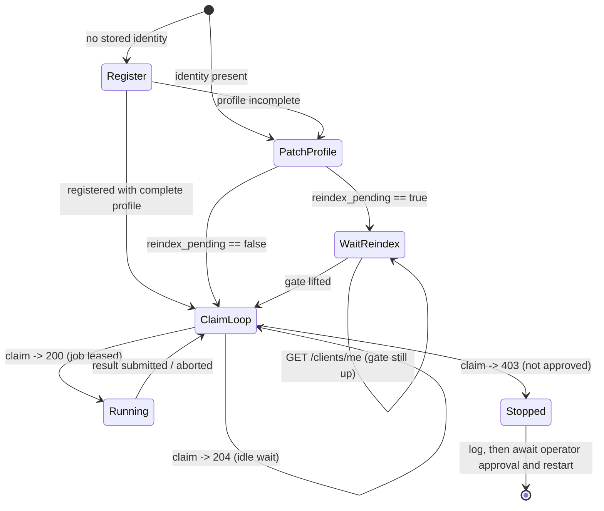
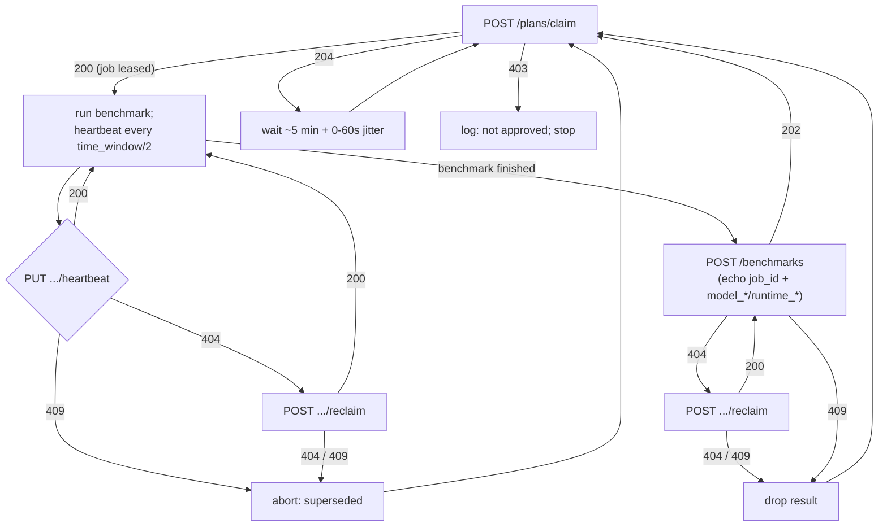

# Client Integration Guide

This guide is for authors of **client software** that runs benchmarking jobs
handed out by the planner. It describes the client's obligations, its lifecycle,
and how it should behave at each protocol edge — the parts a correct client must
get right that the endpoint reference alone does not spell out.

It assumes a client that already knows how to run a benchmark and submit a result
(the ad-hoc path). What is new here is the **planner loop**: the client *claims*
jobs and runs them, instead of being driven manually.

The authoritative wire contract lives in [httpapi.md](httpapi.md) (endpoints and
error tables), [authentication.md](authentication.md) (identity and signing), and
[planner.md](planner.md) (the job lifecycle and queue internals). This guide does
not restate those; it says how a client should *use* them.

## 1. Prerequisites

Before a client can claim work it must satisfy three things.

- **Identity.** The client holds an Ed25519 keypair and a `client_id`, obtained
  once via `POST /clients/register` (see [authentication.md §3](authentication.md#3-registration)).
  The private key is the only secret and never leaves the client. Losing it means
  a new identity — there is no recovery. Registration is idempotent on the public
  key, so a client that registered but failed to persist its `client_id` can
  re-register with the same key to recover it.
- **A synchronized clock.** Every authenticated request is signed over an
  `X-Timestamp`, and the server rejects any timestamp outside a **5-minute
  window** from its own clock ([authentication.md §2](authentication.md#2-request-authentication)).
  A client whose clock has drifted beyond that window fails *every* authenticated
  request with `401` — the symptom is total, not intermittent. Clients must keep
  their clock synchronized (e.g. via NTP).
- **A fresh nonce per request.** Every authenticated request carries an
  `X-Nonce` covered by the signature, and the server accepts each signature
  once ([authentication.md §2.2](authentication.md#22-replay-protection)).
  Generate a new one for every request — including retries. Resending stored
  headers after a timeout is rejected as a replay with `401`; a retry must be
  re-signed.
- **Approval.** New clients start in the `pending` state and are approved
  out-of-band by an operator. A pending client cannot **claim** — `POST
  /plans/claim` returns `403` until approval — so it never enters the planner
  loop. (Its *ad-hoc* submissions are a separate matter: rejected with `403`
  by default, or, when the server sets `[unverified_submissions] enabled =
  true`, accepted and held unscored until an operator promotes them — see
  [httpapi.md §2.7.4](httpapi.md#274-unverified-held-submissions). This never
  applies to plan-attached submissions, which require a claim the pending
  client cannot obtain.) Approval is manual and may take arbitrarily long, so
  the client is best off stopping and waiting for a restart rather than polling
  for it (see §2).

## 2. Startup

At startup a client makes sure the planner holds its current device profile and
capability set and then enters the claim loop.



**Refresh the device profile and capabilities at startup, with one exception.**
Both the device profile and the reported capability set drive job matching (the
server derives capability flags from `device_*` and unions them with the
`capabilities` the client reports directly — see
[planner.md](planner.md#client-matching-rules)), so a returning client — one with
a stored identity, whose hardware or installed runtimes may have changed since it
last ran — should `PATCH /clients/me` at startup to keep matching accurate.
Report installed runtimes as `runtime:<name>` capability flags; the reserved
device-derived namespaces are server-owned and rejected if reported directly.
Because matching compares each flag as a whole, opaque string
([planner.md](planner.md#client-matching-rules)), report **every level you
support**: a client pinned to a specific build reports both the general and the
versioned flag, e.g. `["runtime:llama_cpp", "runtime:llama_cpp:b9999"]`, so it
matches a job requiring either the runtime in general or that exact build. (A
client that reports only the versioned flag matches only jobs that ask for that
exact build — worth calling out, since the versioned flag is easy to mistake for
implying the general one.) A client registering for the first time that supplied a
complete profile and capability set in the registration call has already
established accurate matching input and may proceed straight to the claim loop;
the patch would be a redundant no-op. When in doubt, patching is safe to do
unconditionally: the server only voids the client's queue standing when the
matching input actually *changed*.

- If neither the profile nor the capabilities changed (the common case — the same
  description resubmitted), the response has `reindex_pending: false` and the
  client proceeds straight to the claim loop.
- If either genuinely changed (OS upgrade, added RAM, a GPU installed or swapped,
  a runtime installed or removed), the response has `reindex_pending: true`. The
  client's standing is
  voided: any lease it held was relinquished, and all plan operations are refused
  until the next `queue-maintenance` run re-evaluates it. The client must
  **discard any local in-flight work** and wait for the gate to lift — polling
  `GET /clients/me` for `reindex_pending` to go `false` — before claiming. This
  costs at most one cron interval. See [httpapi.md §2.4](httpapi.md#24-patch-clientsme).

Note `capabilities` is set-granular on PATCH — report the **full** current set;
a present value replaces the stored set wholesale (see
[httpapi.md §2.4.1](httpapi.md#241-request-body)). Section 3 covers how to
choose that set and how it carries across registration and PATCH.

**Prefer to stop rather than poll for approval.** If `claim` returns `403`, the
client is not approved. Nothing in the protocol forbids retrying — a client may
keep calling `claim`, and it will simply keep returning `403` — but because
approval is a manual operator action that can take arbitrarily long, polling
spins indefinitely against a state only a human can change. The recommended
behavior is to log a clear message ("client not approved — an operator must run
`pipette-mgmt clients approve <client_id>`, then restart this client") and exit,
to be restarted after approval. Busy-polling is legal but wasteful.

## 3. Choosing a capability set

Section 2 says *when* to report capabilities. This section says *what* to put in
them. The stakes are asymmetric: an over- or under-reported capability set is
never a protocol error. It is accepted, stored, and then quietly changes which
jobs the client is offered — so the failure mode is not a `400`, it is a client
that polls forever, or one that keeps claiming work it cannot run.

**Everything the matcher knows about a client arrives by one of two routes.**
The server derives flags from the `device_*` profile and unions them with the
`capabilities` the client reports directly; the union is the client's *effective
capability set*, and a single containment check against it decides eligibility
([planner.md](planner.md#client-matching-rules)). The two routes are not
interchangeable, and choosing between them is not a judgment call:

- **If a `device_*` field exists for the fact, use that field.** The ten
  namespaces the server derives — `os:`, `os_version:`, `device:`, `chip:`,
  `form_factor:`, `ram_bytes:`, `gpu:`, `gpu_vram_bytes:`, `npu:`,
  `npu_vram_bytes:` — are reserved, and reporting one in `capabilities` is a
  `400`. That rejection exists to keep exactly one way of expressing each
  device property, so a job's `os:ios` can never miss a client that spelled its
  OS somewhere else.
- **`capabilities` is for everything else** — in practice, what the client
  *has installed or can do*, as opposed to what it *is*. Installed inference
  runtimes are the motivating case and, today, very nearly the only case.

### What earns a flag

The useful test is not "is this true of my client?" but:

> **Would a plan author write this flag in a job's `requires`?**

Capability flags are a *matching vocabulary shared with the people who author
plans*, not telemetry and not an inventory. That framing resolves both
directions of error:

- **Under-reporting is silent.** A flag a job requires and the client does not
  report makes the client ineligible, and the only symptom is `204` — which is
  deliberately indistinguishable from "no work right now" (§5). Nothing tells
  the client it disqualified itself.
- **Over-reporting is a broken promise.** Every flag is client-attested;
  approval gates *who* is trusted, not *what* they claim, and the server
  verifies nothing. A client that reports `runtime:mlx` without MLX installed
  will be handed MLX jobs and will fail them, consuming a claim and a denial
  per attempt. Report what the client can execute *now* — discovered at startup
  from the actual installation, not a hardcoded list of what the build was
  meant to ship with.
- **A flag no job names is merely dead weight.** Harmless, but it does nothing;
  a capability only has effect if some plan selects on it.

### Established flag conventions

| Flag | Meaning | Report when |
|---|---|---|
| `runtime:<name>` | the client can run this inference runtime | the runtime is installed and usable |
| `runtime:<name>:<build>` | the client is pinned to one specific build | the client cannot run any other build of that runtime |
| `runtime:<name>:<component>=<version>` | the version of one component of a composite runtime | the runtime is assembled from several independently versioned sources (see below) |
| `job_schema:<n>` | the client understands revision *n* of the job body | for **every** revision it can parse — this is how incompatible job-format changes are rolled out ([plan-ingestion.md](plan-ingestion.md#schema-revisions-ride-on-capability-flags)) |

Anything else is a legal free-form flag, but coordinate it with the plan authors
before reporting it. A flag has no effect until some plan's `requires` names it,
and the two sides must agree on the exact string — so inventing vocabulary
unilaterally accomplishes nothing.

For `runtime:`, report **every level of granularity the client supports**: a
client that fetches runtimes on demand reports just `runtime:<name>` and is
eligible whichever build a job pins, while a client with a compiled-in build
reports both `runtime:<name>` and `runtime:<name>:<build>` (see §2).

### Composite runtimes get a flag per component

Some runtimes have no single version number. MLX on Apple platforms is really a
pinned set of three independently versioned sources — `mlx-swift`,
`mlx-swift-lm`, and `swift-transformers` — any of which can move without the
others. No one string identifies the build, so a single `runtime:mlx:<build>`
flag either hides the component a plan author actually cares about or forces
them to guess which one it names.

The recommended pattern is to publish a flag per component, appending
`<component>=<version>` to the runtime name, *in addition to* the general and
simplified flags:

```json
"capabilities": [
  "runtime:mlx",
  "runtime:mlx:0.31.6",
  "runtime:mlx:mlx-swift=0.31.6",
  "runtime:mlx:mlx-swift-lm=f5f18ed9d",
  "runtime:mlx:swift-transformers=1.3.3"
]
```

Each level buys something different:

- `runtime:mlx` matches a job that just needs MLX and does not care how it is
  built. Most jobs.
- `runtime:mlx:0.31.6` is the simplified form — whichever component version the
  team treats as *the* MLX version, conventionally the core one. It lets a plan
  author pin a version without knowing the runtime is a composite at all.
- The `<component>=<version>` flags let a job pin the one component that
  matters and stay silent about the rest. A job that needs a tokenizer fix
  landed in `swift-transformers` 1.3.3 requires
  `runtime:mlx:swift-transformers=1.3.3`, and keeps matching as the other two
  components move.

Three constraints carry over unchanged, and each one bites here:

- **The `=` is a convention for the humans reading flags, not syntax.** The
  server never parses inside a flag; matching stays whole-string set
  containment. `=` is chosen over a fourth colon because
  `runtime:mlx:swift-transformers:1.3.3` is indistinguishable from the
  simplified form with a build named `swift-transformers`.
- **No flag implies any other**, so all five must be reported — omitting
  `runtime:mlx` makes the client ineligible for every job that asks for MLX
  generally, however many component flags it publishes.
- **Version values are part of the agreed spelling.** They must be canonical
  (lowercase, no whitespace — a git SHA is fine), and `v1.3.3`, `1.3.3`, and an
  abbreviated SHA of a different length are simply unrelated flags. Fix the
  component names and the version format with the plan authors up front.

Derive these from the *resolved* dependency graph at startup — `Package.resolved`
rather than the version ranges the manifest requests — for the same reason §3
gives above: an over-reported flag is a promise the client cannot keep, and a
requested range is not what got built.

### Spelling is part of the contract

Flags are compared as whole, opaque strings. The server reads the text before
the first `:` only to enforce the reserved-namespace rule; beyond that a colon
carries no meaning, and **no flag implies any other** —
`runtime:llama_cpp:b9999` does not imply `runtime:llama_cpp`, in either
direction. There is likewise no hierarchy, no prefix match, and no normalization
of the value: the server validates flags and rejects bad ones, but never
rewrites them.

Two rules follow.

- **Canonical form is mandatory**: lowercase, with all whitespace removed. A
  non-canonical or empty flag is a `400` at both `POST /clients/register` and
  `PATCH /clients/me`.
- **Agreed spelling is mandatory in practice.** Nothing rejects
  `runtime:llama.cpp`, `runtime:llamacpp`, or `runtime:llama_cpp` — they are
  simply three unrelated flags, and a client that picks the wrong one matches
  nothing while looking perfectly healthy. Emit flags from a shared constant
  agreed with the plan authors rather than assembling them per client from
  whatever the runtime happens to call itself.

### How registration and `PATCH /clients/me` relate

They carry the **same field, the same vocabulary, and the same validation** —
the `400`s listed for `capabilities` are identical on both
([httpapi.md §2.2.1](httpapi.md#221-request-body),
[§2.4.1](httpapi.md#241-request-body)). Registration establishes the initial
set; the PATCH replaces it. The difference that matters is *how* each field
merges:

| | `device_*` fields | `capabilities` |
|---|---|---|
| Merge on PATCH | per field — absent or `null` leaves the stored value | **set-granular** — a present value replaces the whole set |
| Removing one entry | not possible; re-register to reset | resend the full set minus that entry |
| Leaving it untouched | omit the field | omit the key (or send `null`) |

**The one trap is `"capabilities": []`.** An empty array is a *present* value,
so it replaces the stored set with the empty set — a client that matches no
`requires` job at all and can only be reached by an explicit `clients` list.
"No change" is `null` or an absent key; it is never `[]`. Emitting `[]` for an
empty local inventory is the accident to watch for.

Because the PATCH is a wholesale replace, **whatever it sends becomes the
truth.** The practical consequence is that registration and the startup patch
must not be built by two different pieces of code: have one routine produce the
complete current profile and capability set, and feed its output to both the
registration body and the PATCH body. The classic bug is a registration that
enumerates installed runtimes paired with a startup patch that sends a narrower
set — which silently deletes the difference on the client's very next boot.

Two properties make that single routine safe to call unconditionally:

- The server compares capabilities **as a set**, so ordering and duplicates are
  irrelevant. Resubmitting the same flags in a different order is a genuine
  no-op — it does not count as a change and does not trip the reindex gate.
- Only an actual change to the matching input voids queue standing. When the set
  really did change, the cost is the reindex gate described in §2: discard local
  in-flight work and wait at most one cron interval.

### When matching does not go as expected

Since a wrong capability set produces no error, diagnose it by reconstructing
what the server sees. `GET /clients/me` returns the reported `capabilities`
verbatim alongside the stored `device_*` fields; the effective set is that array
unioned with the server's normalization of those fields — lowercased,
whitespace stripped, byte counts as exact decimals (the per-namespace table is
in [planner.md](planner.md#client-matching-rules)). Compare the result against
the job's `requires` and `any_of` clauses: eligibility needs every `requires`
flag present and at least one member of each `any_of` group.

## 4. The work loop

Once past startup, an idle client repeats: claim a job, run it while
heartbeating, submit the result, repeat.



Key obligations while running:

- **One job at a time.** The protocol grants a client at most one lease. A client
  must not claim again while it holds a live lease. (A client that does claim
  while already holding exactly one lease gets that *same* job handed back
  idempotently, so a lost claim response recovers transparently; accumulating
  more than one lease gets the client suspended. See
  [planner.md](planner.md#the-clientmanagement-interaction).)
- **Heartbeat at half the `time_window`.** The claim response reports
  `time_window` as an ISO 8601 duration (e.g. `PT10M`). The client heartbeats at
  half that interval. Each successful heartbeat extends the lease by another
  `time_window` from the current time; the lease lapses `time_window` after the
  last success.
- **Echo the claim's identity.** The submission must carry the claim's `job_id`.
  Its `model_descriptor` / `runtime_descriptor` are serialized from the same
  `spec.model` / `spec.runtime` the claim delivered, so they match without extra
  work. A plan-attached submission is accepted only from the client that currently
  holds the lease.

## 5. Error handling and retries

The single most important distinction for a robust client is between a
**definitive** protocol answer and a **transient** failure.

- **Definitive** answers (`403`, `404`, `409`, `204`) are the server telling the
  client the true state of the world. They drive the state machine above. A
  `413` ([httpapi.md §1.2](httpapi.md#12-request-size-limits)) is definitive
  too: the body exceeded the route's size limit, and resending it unchanged
  fails identically.
- **Transient** failures — `5xx`, connection refused/reset, DNS/TLS errors,
  timeouts — mean the request did not reach a verdict. The client must **retry**,
  not transition. Treating a transient failure as a definitive answer is the
  classic way to lose a job that was fine.

Retry transient failures with exponential backoff: start at ~1–2 s, double to a
~30–60 s cap, with jitter.

| Endpoint | Transient failure (5xx / network) | Definitive answers |
|---|---|---|
| `POST /plans/claim` | back off and retry at the idle cadence | `204` → idle wait; `403` → **stop** (not approved) |
| `PUT /plans/{job_id}/heartbeat` | **retry with short backoff — do not abort.** You have up to `time_window/2` of slack before the lease lapses; if you cannot succeed within it, proactively `reclaim` | `404` → try `reclaim`; `409` → abort (superseded, zombie) |
| `POST /plans/{job_id}/reclaim` | brief retry | `200` → resume + heartbeat; `404`/`409` → abort and re-poll `claim` |
| `POST /benchmarks` | retry with backoff — **safe**, submit is idempotent on `job_id` (a duplicate returns `202`) | `202` → done; `404` → `reclaim` then resubmit; `409` → drop the result (superseded) |

The heartbeat row is the one that matters most: a `503` or a dropped connection
is **not** lease loss. A definitive `404` (lease reaped) is not the end of the
run either — it is a prompt to `reclaim`, and the run dies only if that reclaim
in turn fails with `404`/`409`. A `409` (the lease was taken by another client)
is the one heartbeat answer that ends the run outright.

### Idle polling cadence

When `claim` returns `204` (no work), wait approximately **5 minutes plus 0–60 s
of jitter** before retrying; the jitter avoids synchronized polling bursts across
the fleet. The interval may be configurable, but neither hammer the server nor
sleep so long that throughput suffers. Note that `204` is deliberately
indistinguishable between "no eligible job right now" and "this client is
suspended" — the client treats both identically and simply keeps polling; an
operator clearing a suspension resumes work with no client action required.

## 6. Retriable vs. non-retriable failures

Every failure submission carries a required `retriable` flag
([httpapi.md §2.7.2](httpapi.md#272-failure-variant)). Set it by asking one
question:

> **Could another device that is eligible for this job plausibly succeed?**

- **Yes, or unsure → `retriable: true`.** This is the safe default. The failure
  looks specific to *this* client — out of disk, thermal throttling, a transient
  local fault, a transient failure fetching the model or benchmark definition.
  The server records a denial for this client and keeps the job available to
  others.
- **Definitely not → `retriable: false`.** The job is broken independent of the
  device and would fail the same way anywhere, so re-running elsewhere is
  pointless. This is the narrow shortcut for clearly unworkable jobs: the claim
  response is invalid JSON or internally contradictory, the referenced benchmark
  does not exist (a permanent `404` from `GET /benchmarks/{benchmark_id}`), the
  model artifact is malformed. A non-retriable failure is the job's terminal
  result and tears the job down.

Mapping a specific runtime's exit codes and error output onto this question is
left to the client author — runtimes differ too much for a general rule. When in
doubt, choose `retriable: true`: a wrongly-retriable job is bounded by its
`expires_at`, whereas a wrongly-non-retriable job is discarded for the whole
fleet on one device's say-so.

A failure is reported through the same `POST /benchmarks` endpoint as a result,
with `message_type: "failure"`. The body echoes the claim's `job_id`,
`benchmark_id`, and `model_*` / `runtime_*` fields verbatim, and carries the
`retriable` flag plus a human-readable `failure_reason` — conventionally a
timestamp followed by the runtime's own error output. No device or metric fields
are sent. A client that ran out of memory loading the model reports a *retriable*
failure:

```json
{
  "message_type": "failure",
  "job_id": "job-550e8400-e29b-41d4-a716-446655440000",
  "benchmark_id": "prefill_throughput_256",
  "failure_reason": "[2026-03-10T12:04:51Z] llama-server failed to load model: out of memory",
  "retriable": true,
  "model_name": "llama-3.2-1b",
  "model_quant": "q4_0",
  "model_descriptor": "{\"org\":\"meta-llama\",\"path\":\"Llama-3.2-1B-Q4_0.gguf\",\"repo_name\":\"Llama-3.2-1B-GGUF\",\"source\":\"huggingface\",\"type\":\"gguf_text\"}",
  "runtime_name": "github.com/ggml-org/llama.cpp",
  "runtime_version": "b5000",
  "runtime_descriptor": "{\"flavor\":\"macos-arm64\",\"repository_url\":\"github.com/ggml-org/llama.cpp\",\"repository_version\":\"b5000\",\"type\":\"llamacpp_cli_stock_tools\"}"
}
```

A terminal failure differs only in the flag and the reason — for a benchmark that
does not exist anywhere, `"retriable": false` with a `failure_reason` such as
`"[2026-03-10T12:04:51Z] benchmark prefill_throughput_256 not found (404 from GET /benchmarks/{id})"`.
See [httpapi.md §2.7.2](httpapi.md#272-failure-variant) for the complete field
table.

## 7. Crash recovery and persistence

**A v1 client persists no benchmark state to disk.** This is a correctness-neutral
simplification, for two reasons rooted in the protocol:

- The server already makes a zero-persistence client correct. **Claim is
  idempotent** — a client still holding a live lease gets the same job back — and
  **submission is idempotent** on `job_id` — a duplicate returns `202` and is
  discarded. So a client that crashes and simply re-runs is never double-scored
  and never stranded.
- Persisting partial *computation* rarely pays off. Speed benchmarks
  (prefill, decode, latency, memory) are only meaningful run as a whole — the
  reported statistics need every repetition — so a partial run is worthless and
  must be re-run regardless. Only long eval runs could in principle benefit from
  checkpointing partial completions.

The two recovery situations, and what handles each:

- **Network blip, process still alive.** The `job_id` and echoed fields are in
  memory. When the lease has been reaped mid-outage, `POST /plans/{job_id}/reclaim`
  re-acquires the same job and the client submits normally. No disk needed.
- **Process died mid-run.** The in-progress computation is gone. The client
  re-runs the work from scratch (on restart it re-enters the claim loop; if its
  lease is still live it receives the same job back). Nothing on disk would have
  saved the computation.

Per-sample checkpointing of long eval runs is a possible **future** optimization,
deliberately out of scope here: it carries corruption risk across an unclean
crash, and the server may void the client's standing (via the reindex gate)
before the resumed work can be submitted, forcing it to be discarded anyway.

## 8. Concurrency

A lease is scoped to one `client_id`, and a `client_id` holds at most one lease.
A host that can genuinely run *N* benchmarks in parallel therefore registers *N*
separate identities (N keypairs, N `client_id`s), one per concurrent slot.

This is a rare case and is not optimized for: most target devices (phones,
single-board computers, and the like) either cannot run more than one benchmark
at once or have memory bandwidth that a single benchmark already saturates. A
client that runs one benchmark at a time needs one identity and can ignore this
section.

## 9. Job configuration fields

Everything a client needs to execute arrives in the claim's `spec`
([httpapi.md](httpapi.md#292-response-200-ok)): `benchmark`, `model`, `runtime`,
and the optional `model_flags` / `runtime_flags` / `benchmark_flags` groups.
`spec.benchmark_flags` is where the HTTP timeout, doom-loop detection settings,
and the readiness wait live.

`spec` is one type — `pipette-plan-types`' `ClientRunSpec` — so a client
deserializes it whole rather than field by field, and the flag groups' embedded
`benchmark_type` / `runtime_type` / `model_type` discriminants validate the cell
on arrival. Two consequences worth designing for:

- **A spec you cannot read is terminal, not transient.** Absent, unparseable,
  naming a benchmark that disagrees with the envelope's `benchmark_id`, or pairing
  a model and runtime that are incompatible — all mean the job is mis-authored.
  Report `retriable: false` rather than letting the lease lapse: retrying it here
  or on another device fails identically, and a lapsed lease just re-serves the
  same unrunnable job until it expires.
- **A gated model's access token may travel inside `spec.model`.** Treat it as a
  secret: never log a raw spec, and strip `auth_token` before printing one. If a
  client injects its own host token, do so only when the field is absent, so an
  explicitly supplied token wins.

One field of the *submission* is specified, because it is the one the server
cannot check. The `benchmark_flags` you submit reports the harness configuration
a run **resolved to** — the values it applied, not the values it was handed. Do
not confuse it with the claim's `spec.benchmark_flags`: that one is what the plan
authored, and this one is what the run actually did.

That distinction has teeth for readiness, and the deciding part of readiness does
not come from the claim: `spec.benchmark_flags` may carry a readiness *wait*
(`max_wait_secs`), but nothing about thermal gating. Whether a run waited for the
device to cool is decided entirely client-side, so the submission is the only
record of that decision anywhere, and a wrong value is undetectable.

The failure mode is echoing the configuration instead of the outcome. A cell
that pinned no thermal setting, run on a host that waived the criterion, ran
ungated — but its *authored* value was "unset". Submitting that records "no
opinion" for a run that had a definite one, which is worse than omitting the
field, because it reads as authoritative. Submit `"skip_thermal": true`.
The same goes for a deadline the client defaulted rather than read from a plan:
report the seconds it used.

How a client arrives at the resolved value — precedence between its own
configuration, its environment, and its defaults — is its own business; the
server specifies only that the submitted value is the one that took effect.

The same holds for the settings a claim *does* carry: submit the value applied,
which is the claimed one unless the client overrode it. A setting the client's
harness has no notion of is omitted from the object rather than sent as null.
The full contract, the canonical shape and the `benchmark_flags_sha256`
grouping key are in
[storage.md § benchmark_flags](storage.md#benchmark_flags).

The submission's `model_flags` / `runtime_flags` are normalized and hashed the
same way, with one relaxation: they accept a plain string as well as JSON, so
neither spelling is rejected. Prefer JSON in new clients — the server sorts its
keys and strips its whitespace before storing, so two clients reporting the same
configuration group under one `runtime_flags_sha256` however each formatted it.
A plain string still groups, but only against a byte-identical other string.
See [storage.md § model_flags / runtime_flags](storage.md#model_flags--runtime_flags).

> **Still to be written:** how a client applies each individual flag from
> `spec` — the mapping from a flag group to runtime arguments or generation
> settings. Until then, treat unrecognized fields per the general rule and
> tolerate them.

## 10. Reporting your own version

Send `client_version` on every submission, success and failure alike: the
version of **your** build, not of the runtime you drove. `runtime_version`
already covers the runtime; this covers the harness around it, and the two move
independently. A client that changes how it warms up, times, or gates a run
changes the numbers without touching the runtime at all — with no
`client_version` on the row, that shift is indistinguishable from a device or
model change.

The value is opaque: the server stores it verbatim and never parses, orders, or
compares it, so any scheme works — a semver, a git describe, a build number.
Pick one and keep it stable, since its whole value is as a grouping key.
Whatever you send must be non-blank; omit the field entirely rather than
sending `""` if you have nothing to report.
