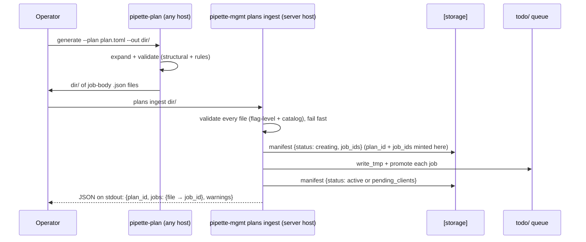
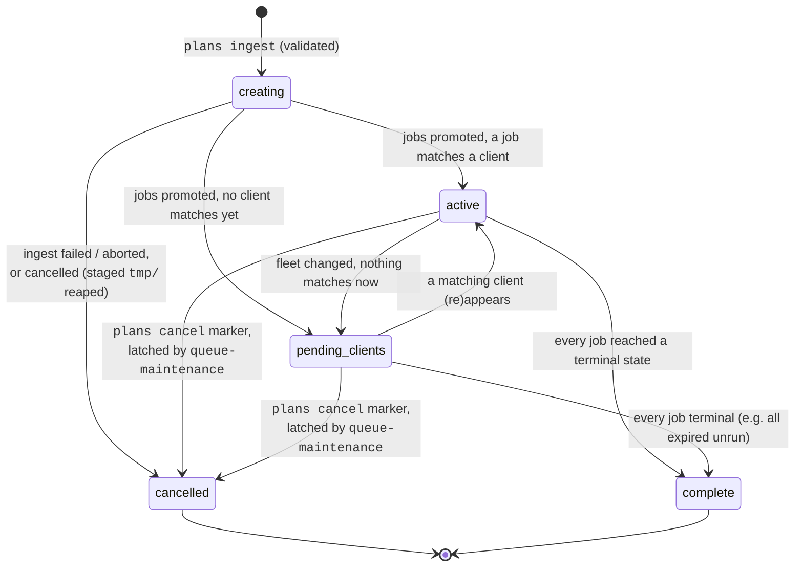
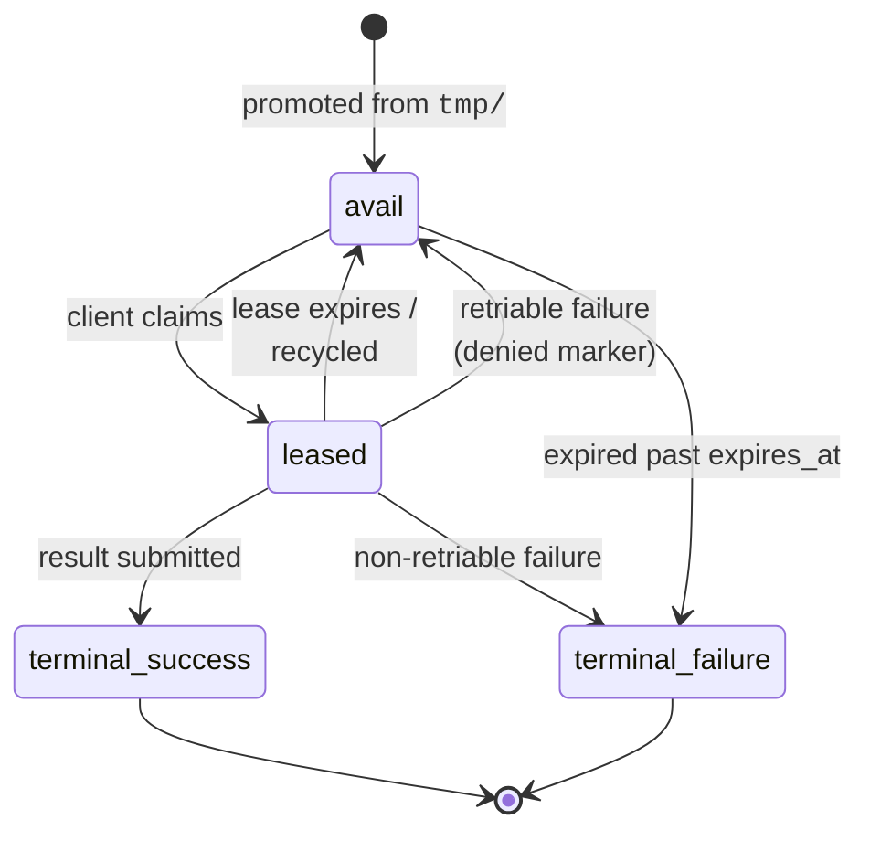

# Plan ingestion & job-file handoff

This document specifies how a **plan** becomes scheduled work. Expansion is the
job of the standalone **`pipette-plan`** binary (in the `pipette-clients`
repository): it validates a plan, expands it into individual **job files**, and
writes them to a local directory. `pipette-mgmt` then **ingests** that
directory in bulk — validating what it can without understanding job contents,
staging the jobs into the scheduler queue (`todo/`), and tracking the plan's
lifecycle. It also defines the capability-based matching model the scheduler
uses to decide which client may run which job.

## 1. Division of responsibility

**`pipette-plan` owns plan knowledge.** The plan schema, the benchmarks ×
models × runtimes matrix expansion, model/runtime compatibility, and the
capability-requirement rules (which hardware a model or runtime demands) all
live in `pipette-plan`. It is the only component that understands what a job
*means*.

**`pipette-mgmt` owns scheduling.** It matches jobs to clients by capability
flags, leases them out, recycles and expires them, and tracks each plan's
manifest and lifecycle. It schedules jobs **without understanding them**, and the
job body is structured to make that explicit: a scheduling **envelope** the
server owns, wrapped around a **`spec`** it stores and forwards verbatim.

| Field | Where | Why the server reads (or writes) it |
|---|---|---|
| `job_id` | envelope | server-minted at ingestion; the sole task identity |
| `requires`, `any_of`, `clients` | envelope | eligibility — the inputs to capability matching |
| `expires_at` | envelope | resolved at ingestion, encoded into the `avail/` filename, and re-read when a lapsed lease recycles |
| `spec` | — | the run specification, **stored and forwarded untouched** |
| `spec.benchmark` | spec | resolved against the benchmark catalog: fills the claim response's `benchmark_id`, and attributes synthetic failure records |
| `spec.model`, `spec.runtime` | spec | **presence checked** at ingestion; their contents are read only to derive an opaque `model_descriptor` / `runtime_descriptor` for a synthetic failure record |
| `time_window` | response only | the lease increment, written by the claim handler; never stored, and ignored if a job body carries it |

Everything else inside `spec` — the flag groups, whatever future fields appear —
passes through the server untouched. That is the contract which lets the spec
schema evolve in `pipette-clients` without a `pipette-mgmt` release (see §7 on
schema revisions), and the reason `spec` is nested rather than flattened: a new
spec field cannot collide with an envelope field the scheduler depends on.

The envelope never reaches the device. The claim response carries `job_id`,
`benchmark_id`, `time_window`, an optional `expires_at`, and `spec` — the
eligibility fields are inputs to selection, already spent once a job is handed
out (see [httpapi.md](httpapi.md) §2.9.2).

`pipette-plan` retains its existing transport-dispatch mode (adb/ssh/ios/…)
unchanged; the server mode is a second mode alongside it, operating on a
**distinct plan format** (§4). It delivers its expansion either way the
operator chooses: written to a local directory of job files for
`plans ingest` (§7), or submitted directly to `POST /plans` (§11).

## 2. Concepts

- **Plan** — a declarative TOML document describing a matrix of benchmarks ×
  models × runtimes and the device eligibility for each combination. Authored
  by an operator, expanded locally by `pipette-plan`. The server never sees
  the plan document itself, only its expansion.
- **Job** — one benchmark run of one model on one runtime, eligible to a set
  of clients. The unit the scheduler leases to a device. Job files live in
  `todo/` and are described by [planner.md](planner.md).
- **Plan id** (`plan-{UUIDv7}`) — minted by the server at ingestion, when the
  plan manifest is created, and recorded only there: job bodies never carry
  it. It is the handle for progress and cancellation, and the key of the plan
  manifest. A *per-plan grouping* identity, distinct from a job's own
  `job_id`.
- **Job id** (`job-{UUIDv7}`) — minted by the **server** during ingestion,
  immediately before the job is staged. Server minting keeps `avail/` keys in
  arrival order (a property the eligible-index cursor depends on), which ids
  minted at generation time would not guarantee — a directory can be ingested
  long after it was generated, or plans ingested in a different order than
  they were generated.
- **Plan name** — an optional label for human reference, supplied by the
  operator at ingestion (`--plan-name`) and carried on the plan manifest; not
  an identity. It never appears in job bodies: it exists for listing plans and
  reporting progress, which clients play no part in, and server-only data does
  not ride in client-facing payloads.
- **Capability flag** — a short string describing something a client can do or
  is (`os:ios`, `os_version:26.1`, `device:iphone17`, `job_retry`, or any
  free-form string). Matching is defined entirely in terms of these.

## 3. Pipeline



Both commands are CLI tools run manually; `plans ingest` runs on the
management server's host with direct storage access, like the other
`pipette-mgmt` subcommands, and neither step involves HTTP or authentication.
Submission also has an HTTP form — `POST /plans` (§11), the same ingestion
pipeline behind an authenticated endpoint — and `pipette-plan` supports it as
an alternative output: the same expansion submitted directly from any host,
no directory or server-host access involved. The file-based path ships
first.

## 4. The server-mode plan format (summary)

The authoritative definition lives in `pipette-clients`; this section
describes only what shapes the handoff. A server-mode plan is a **distinct
format** from the local-dispatch format: it has no transports. Each
`[[variants]]` block pairs a sub-matrix of benchmarks × models × runtimes with
the **eligibility** for those runs:

```toml
benchmarks = ["decode_throughput_512_100", "end_to_end_latency_512_256"]
# expires_at = "2026-08-01T00:00:00Z"      # optional; stamped on every job

# iOS Apple Foundation Model — one benchmark, and also pinned to one client.
[[variants]]
requires   = ["os:ios"]                     # supported-iPhone any_of injected by rules (§6.1)
clients    = ["ev1_9f2c…"]                   # eligibility is (this client) ∪ (requires match)
models     = [{ type = "apple_foundation_text" }]
runtimes   = [{ type = "apple_foundation" }]
benchmarks = ["decode_throughput_512_100"]  # per-variant override of the top-level list

# macOS MLX — both top-level benchmarks.
[[variants]]
requires = ["os:macos"]                      # requires-only; any matching client is eligible
models   = [{ type = "mlx", source = "huggingface", org = "LiquidAI", repo_name = "LFM2.5-350M-MLX-4bit" }]
runtimes = [{ type = "mlx_macos_pipette", version = "0.20.0", requirements = { type = "catalog" }, flavor = "macos-arm64" }]
```

This plan expands into **3 jobs**: variant 1 → 1 benchmark × 1 model × 1
runtime = 1, variant 2 → 2 benchmarks × 1 model × 1 runtime = 2. Each job body
carries the plan's `expires_at`, when set.

A `clients` entry is a **management-server client id** (`ev1_…`), naming a
registered device directly. Transport definitions (adb serials, binary paths,
ssh hosts) have no analog in this format: the plan declares *eligibility*, not
execution targets.

## 5. Capability matching

Client selection is a single rule: **set-superset containment.**

A client's **effective capability set** is computed internally as:

```
effective_capabilities(client) = normalize(device_* profile) ∪ reported capabilities
```

Clients report their `device_*` profile over the ordinary wire protocol; the
server *normalizes* each populated field into a reserved-namespace flag —
lowercasing and stripping whitespace (the **canonical form**), so
`device_os_name: "iOS"` → `os:ios` and `device_name: "iPhone 17 Pro"` →
`device:iphone17pro` — and unions the result with the capability flags the
client reports directly (e.g. `runtime:llama_cpp`). One set-containment check
then drives all matching.

Client-reported flags must themselves be in canonical form (lowercase, no
whitespace) and may **not** use a reserved namespace — the server owns those,
so reporting `os:ios` directly (a device property a client could otherwise
fake) is rejected at register / `PATCH /clients/me`.

A job's requirement is a conjunction of **clauses** (conjunctive normal form):
a flat `requires` set that must all be present, plus zero or more `any_of`
groups, each satisfied by **at least one** member. A single required flag is
just a one-member clause, so a job with only `requires` is the common special
case.

A job is eligible to a client when:

```
client is explicitly listed in the job's `clients`
  OR  ( effective_capabilities(client) ⊇ job.requires
        AND every job.any_of group shares at least one flag with
            effective_capabilities(client) )
```

`any_of` groups are injected by `pipette-plan`'s rules (§6.1) — a device
family is the motivating case: an iOS Apple-Foundation job requires the device
be one of a curated list of supported models, so a new model that can't run it
is handled by omitting it from the list. Each member is still compared by
exact string equality, so `any_of` adds a disjunction without adding any
pattern matching. The server evaluates `any_of` clauses; it plays no part in
authoring them.

Malformed or unmet requirements fail closed (the client is simply not
eligible), so a bad requirement can never widen eligibility: a `requires` that
is empty, not a JSON array, or contains a non-string element matches nobody,
as does an empty `any_of` group. The eligible set is materialized as
`eligible/` markers by `queue-maintenance`; ingestion reuses that same
materialization, with the matcher generalized from set containment to the
clause form above.

**Every** device attribute is matched this way, including RAM
(`ram_bytes:17179869184`): the byte count is a flag like any other, matched by
its exact value. Lab devices are effectively identical, so exact match is
sufficient and is in fact *preferable* for benchmark replication — it pins a
run to one specific, reproducible hardware configuration.

The containment is over the **set** (`effective_capabilities ⊇ requires`);
each flag is compared as a whole, opaque string, so `runtime:llama_cpp:b9999`
and `runtime:llama_cpp` are two distinct, independent flags. Granularity is
thus explicit on both sides — a client advertises **every level it supports**
(an iOS client pinned to one build reports both `runtime:llama_cpp` and
`runtime:llama_cpp:b9999`, so it matches a job requiring either), and a plan's
`requires` flags are written in the same canonical form the server normalizes
device attributes into, so they line up exactly.

### Reserved capability namespaces

The server owns these namespaces — it derives them from the `device_*`
profile, and rejects a client that tries to report one directly. String values
are slugified (lowercase, whitespace removed); byte counts are matched exactly
as their decimal value.

| Namespace | Meaning | Source |
|---|---|---|
| `os:<name>` | operating system | `device_os_name` |
| `os_version:<v>` | OS version | `device_os_version` |
| `device:<model>` | device model/generation | `device_name` |
| `chip:<model>` | SoC | `device_chip_model` |
| `form_factor:<ff>` | phone/tablet/laptop/… | `device_form_factor` |
| `ram_bytes:<n>` | total RAM (exact) | `device_ram_bytes` |
| `gpu:<model>` | discrete GPU | `device_gpu_model` |
| `gpu_vram_bytes:<n>` | GPU VRAM (exact) | `device_gpu_vram_bytes` |
| `npu:<model>` | neural accelerator | `device_npu_model` |
| `npu_vram_bytes:<n>` | NPU VRAM (exact) | `device_npu_vram_bytes` |
| `runtime:<name>` | an installed/available runtime | reported by the client |
| *(free form)* | anything else | reported by the client |

### Runtime versions

A runtime's **version to run** belongs to a variant's runtime descriptor (the
*what to execute*), not to eligibility (`requires`). Keeping it out of
`requires` lets platforms with different version semantics coexist without any
special matching:

- A client that fetches runtimes on demand (e.g. Android) is told which build
  to run by the descriptor, so it advertises just `runtime:<name>` and is
  eligible whatever build a job pins.
- A client with a fixed, compiled-in build (e.g. iOS) runs only that build, so
  it advertises both `runtime:<name>` and the concrete
  `runtime:<name>:<build>`. A run that must pin to those devices puts
  `runtime:<name>:<build>` in `requires` — an ordinary exactly-compared flag.

Because each **variant** pairs its eligibility with its own runtime
descriptor, a run spanning platforms with different version rules is authored
as separate variants in one plan — an Android variant whose descriptor fetches
the build, and an iOS variant that runs the device's compiled build — each
with concrete `requires` flags. A single variant is the wrong tool for
spanning them, precisely because their version semantics differ.

## 6. Validation

Validation happens in two layers, each owned by the component with the
knowledge to perform it. Both layers **fail fast**: a bad plan produces no
job files, and a bad directory stages no jobs.

### 6.1 Generation time (`pipette-plan`)

Everything that requires understanding the plan's contents:

- Model↔runtime structural compatibility and orphan detection (a model or
  runtime that matches nothing in its variant).
- Every variant declares at least one of `requires` / `clients`.
- The **capability-requirement rules**: a table keyed on model/runtime kind
  that injects the hardware policy a plan author shouldn't have to know —
  required flags (`requires`), device-family disjunctions (`any_of`, e.g. the
  supported-iPhone list for Apple Foundation on iOS), commit-to-exactly-one
  guardrails (`one_of`, e.g. one `os:`), and conditional injection (`when` a
  committed flag is present). Contradictions — a variant whose effective
  requirements contain two flags from a mutually exclusive namespace, or an
  AFM variant requiring `os:android` — are rejected here.

The rules are **hardcoded in `pipette-plan`**, in a dedicated, easy-to-edit
module. A rules change (a new supported device, a raised minimum) is a code
change and a release of `pipette-plan` — an ordinary, reviewable edit in the
same repository that defines the model and runtime kinds. Keeping the rules
in code preserves the exhaustiveness guarantee for free: a `match` over the
model/runtime kinds does not compile until every kind states its policy, so a
newly added kind can never ship with no policy at all.

### 6.2 Ingestion time (`pipette-mgmt plans ingest`)

Everything the server can check **without understanding job contents**, plus
the checks only the server *can* perform because they consult server-side
state. The whole directory is validated before anything is written; any
rejection rejects the ingest as a unit.

Rejections:

- A file is not a JSON object, or already carries a `job_id` or `plan_id`
  (identity is server-assigned at ingestion; pre-set identity fields are a
  malformed handoff).
- A job declares neither a non-empty `requires` nor a non-empty `clients`,
  or its `requires` / `any_of` / `clients` fields are malformed (wrong JSON
  shape, non-string elements, flags not in canonical form).
- More than one flag from the same **reserved namespace** in a job's flat
  `requires` set (e.g. both `os:ios` and `os:android`). The server already
  owns the reserved-namespace table — it is the same table that normalizes
  `device_*` profiles into flags — so this check adds no new list to keep in
  sync. It applies only to reserved namespaces and only to the flat
  `requires` set: `any_of` groups are *deliberately* many flags from one
  namespace, and free-form flags may legitimately share a prefix.
- Malformed `expires_at`.
- No `spec`, or a `spec` that is not a JSON object. A body without one has no
  runnable content: it would ingest cleanly and then be leased out as a claim
  every client rejects terminally. This is also what refuses a body written
  against a pre-envelope revision of the schema, where the spec content was flat.
- `spec.benchmark` absent, or not in the authoritative benchmark catalog. This is
  the one spec field the server resolves, and it is server-domain knowledge — the
  catalog lives on the server, and the server must resolve this same id later
  to build synthetic failure records (§9), so an unknown id accepted now
  would become an unresolvable error in `queue-maintenance` later.
- `spec.model` or `spec.runtime` absent. A **presence check only** — the server
  does not validate their contents and could not (partners define their own model
  formats and runtimes). Together with `benchmark` they are the three fields a run
  specification cannot omit, so checking they exist costs nothing and converts a
  terminal device-side rejection into an ingestion error the operator sees.

Warnings (the plan is accepted):

- A group of jobs matches **no registered, approved client**. A user may
  legitimately queue work ahead of the clients that will run it. Warnings are
  **grouped by identical requirement set** (`requires` + `any_of` +
  `clients`), not emitted per job — "148 jobs requiring os:ios × supported
  iPhones match no registered, approved client" — so a large plan stays
  readable. Each warning also lists the minted `job_id`s of the jobs in its
  group (§8), so the operator can see exactly which jobs are affected. The
  groups are derived from the jobs at ingestion; the server has no notion of
  the plan's variants.

## 7. The handoff contract (job-file directory)

`pipette-plan` writes its expansion into a user-specified local directory:

- Every `*.json` file in the directory is a job body; other files are
  ignored. There is no manifest file — **the directory is the manifest**. The
  handoff carries no identity of any kind: `plan_id` and the `job_id`s are
  born at ingestion, and `plan_id` lives only in the plan manifest.
- File names are arbitrary but must be unique (they are file names); the
  ingest output maps them to the minted job ids, and they have no meaning
  beyond that report. Ingestion processes them in **file-name order**, so the
  same directory always mints ids in the same order — `readdir` order is
  arbitrary, and §8's minting (and therefore the arrival-ordered `avail/` keys
  the eligible-index cursor depends on) follows input order.
- Each file is a complete job body per [planner.md](planner.md)'s schema,
  **minus `job_id`**, which the server mints and stamps at ingestion.
- The ingest command treats the directory as read-only: it neither deletes
  nor renames the input files.
- The handoff is trusted to be complete and to be ingested once: a truncated
  directory (say, an interrupted copy) ingests as a smaller, valid plan, and
  ingesting the same directory twice creates a second plan with duplicate
  jobs. The `job_count` in the ingest report is the operator's check against
  the former; the latter is an accepted operator-error window. Future work
  closes both gaps: a server-side duplicate-job check — spanning plans, keyed
  on job content rather than identity — that quietly omits jobs whose results
  are already collected, so re-running a benchmark to gather data that
  already exists is avoided and re-ingesting costs nothing.

### Schema revisions ride on capability flags

The job body is a contract between `pipette-plan` (writer) and the device
clients (executors); the server carries it opaquely. When that contract
changes incompatibly, no new mechanism is needed — the existing matching
machinery expresses it: jobs written to revision *n* carry `job_schema:<n>` in
`requires`, and each client reports a `job_schema:<n>` flag for **every
revision it understands**. A client that can't parse a revision simply never
matches its jobs. The server needs no knowledge of what any revision means.

> **Not yet wired up.** No plan emits a `job_schema:<n>` requirement and no
> client reports the flag, so the mechanism is currently inert — a flag no job
> names does nothing. The envelope/`spec` split described in §1 is precisely the
> kind of incompatible change it exists for, and it was rolled out as a hard
> cutover instead: a client expecting `spec` rejects a flat body terminally, and a
> client predating `spec` cannot read one. That was safe only because the queue
> held no such jobs at the time. The next incompatible revision should not rely on
> the same luck — implement the flag on both sides in the change that introduces
> it.

## 8. Ingestion flow (atomic-ish)

In this flow the ingest command acts in the **planner role**
([planner.md](planner.md)): it stages complete job bodies, so promoting its
own `tmp/` writes into `avail/` is safe — the atomic rename hides any partial
write, and the ingest command is just another uncoordinated `todo/` writer,
indistinguishable from any external planner. There is no multi-object atomic
write, so ingestion stages first and promotes second, gated by the manifest
status:

1. Read and validate every `*.json` in the directory (§6.2). Any failure
   stops here — nothing has been written.
2. Mint the `plan_id` and a `job_id` per job, stamp each `job_id` into its
   body, and write the plan manifest `{status: creating, job_ids}`, with the
   operator-supplied `--plan-name` when given. Because the ids are born here,
   an ingest can never collide with a previous one: re-running `plans ingest`
   after a crash simply starts a fresh plan, and the manifest the crashed run
   left stuck in `creating` is torn down by `queue-maintenance` (§9).

   Each job's **expiry is resolved in this same step** and stamped back into the
   body: the handoff's `expires_at` when it carries one, else a default of **30
   days** past ingestion, so an operator who omits an expiry still gets a
   bounded queue lifetime instead of a job that sits in `avail/` forever. The
   handoff supplies the extended ISO 8601 form (§4); the stamped value is the
   basic form that job bodies and queue filenames use, making ingestion the one
   place that converts between them. Stamping is load-bearing rather than
   cosmetic — lease recycling rebuilds a job's `avail/` key from the **body's**
   `expires_at` ([planner.md](planner.md)), so a body left unstamped would come
   back from a lapsed lease as `never` (losing the bound) or fail the rebuild
   outright (stranding the job in `leased/`).
3. `write_tmp` then `promote_avail` (atomic `tmp/` → `avail/` rename) each
   job, the `avail/` filename carrying the resolved `expires_at` from step 2 —
   the same value now in the body, so the two can never diverge.
4. Write the manifest status: `active` if at least one job matches a
   registered, approved client, else `pending_clients` — the same match check
   that produced the §6.2 warnings.
5. Emit the ingest report as JSON on stdout:

```json
{
  "plan_id": "plan-018fce2a-7b41-7e00-9c3d-2a1b6f4e8d20",
  "plan_name": "afm-smoke-2026.07",
  "job_count": 3,
  "jobs": {
    "cell-000.json": "job-018fce2a-7b41-7e00-9c3d-2a1b6f4e8d21",
    "cell-001.json": "job-018fce2a-7b41-7e00-9c3d-2a1b6f4e8d22",
    "cell-002.json": "job-018fce2a-7b41-7e00-9c3d-2a1b6f4e8d23"
  },
  "warnings": [
    {
      "message": "2 jobs requiring os:macos match no registered, approved client",
      "job_ids": [
        "job-018fce2a-7b41-7e00-9c3d-2a1b6f4e8d22",
        "job-018fce2a-7b41-7e00-9c3d-2a1b6f4e8d23"
      ]
    }
  ]
}
```

If ingestion fails partway, nothing is claimable that shouldn't be: staged
`tmp/` files are reaped by the existing stale-`tmp/` cleanup, and a manifest
stuck in `creating` is resolved through the same teardown path as cancel
(§9). `queue-maintenance` indexes the new `avail/` jobs into `eligible/`
markers on its next cursor pass, so claimability lags ingestion by up to one
cron interval.

## 9. Plan lifecycle

A plan manifest (`plans/{plan_id}.json` in the `[storage]` backend) tracks
the plan through its life. Manifests live in durable storage, not the
ephemeral `todo/` queue, so a finished or cancelled plan stays queryable long
after its jobs have left the queue.



- **creating** — manifest written with the full job-id list; job bodies are
  being staged. Nothing is claimable yet.
- **active** — all jobs promoted into `avail/`; at least one outstanding job
  is eligible to some registered, approved client.
- **pending_clients** — jobs are promoted and outstanding, but **none**
  currently matches any registered, approved client. This is the honest state
  for a plan queued ahead of the fleet, or one whose only capable clients have
  deregistered; it is not an error. The plan waits, and `queue-maintenance`
  returns it to **active** as soon as a matching client (re)appears. *Partial*
  starvation — some jobs matched, some not — stays **active**, with the
  unmatched jobs reported in `progress_snapshot.starved` (below).
- **complete** — every job in the manifest has reached a terminal state
  (succeeded, or terminally failed/expired).
- **cancelled** — an operator cancelled the plan, or ingestion aborted before
  completing. No further jobs will be handed out.

### Manifest contents

The manifest holds the plan's identity and lifecycle **plus a progress
snapshot** that the `queue-maintenance` pass refreshes each run — which is why
`plans status` is a single read:

```json
{
  "plan_id": "plan-018fce2a-7b41-7e00-9c3d-2a1b6f4e8d20",
  "plan_name": "afm-smoke-2026.07",
  "status": "active",
  "created_at": "2026-07-20T17:55:00Z",
  "job_ids": ["job-018fce2a-…d21", "job-018fce2a-…d22", "job-018fce2a-…d23"],
  "warnings": [
    {
      "message": "2 jobs requiring os:macos match no registered, approved client",
      "job_ids": ["job-018fce2a-…d22", "job-018fce2a-…d23"]
    }
  ],
  "progress_snapshot": {
    "computed_at": "2026-07-20T18:30:00Z",
    "counts": { "total": 3, "finished": 1, "running": 1, "available": 1, "failed": 0 },
    "starved": [
      { "requires": ["os:macos"], "any_of": [], "clients": [], "job_ids": ["job-018fce2a-…d23"] }
    ]
  }
}
```

- `job_ids` is the authoritative membership list and the **only** record of
  which jobs belong to the plan — job bodies carry no `plan_id`. Every server
  path that connects a plan to its jobs (progress counts, the **complete**
  check, cancellation teardown, starvation reporting) runs in the plan→jobs
  direction through this list; no path needs a reverse job→plan lookup — in
  particular, results submission is entirely `job_id`-keyed and never touches
  a manifest. The list stays internal; `plans status` serves a projection
  without it.
- `progress_snapshot` is produced whole in one `queue-maintenance` run, so its
  `computed_at` dates the `counts` and `starved` together. `starved` lists
  the outstanding jobs that currently match no registered, approved client,
  grouped by identical requirement set — the ongoing, refreshed form of the
  ingestion-time `warnings` (§6.2), and what surfaces *partial* starvation
  while the plan is still **active**. It is a report of unmatched jobs, not a
  plan-structure concept: the groups are derived from the job bodies.
- Status is reconciled by the maintenance pass, which is also the sole writer
  of `progress_snapshot`: each run it recomputes `status` among **active** /
  **pending_clients** / **complete** from the queue state and writes the
  refreshed snapshot in the same pass. Ingestion writes the initial
  `creating` and the first **active** / **pending_clients**. **cancelled**
  and **complete** are terminal latches the pass never leaves. Cancellation
  is signaled out-of-band by a create-only marker, never by mutating `status`
  directly, so a cancel can never be lost to a concurrent status refresh.

There is no completion-time estimate. Progress is the counts; an operator who
wants wall-clock forecasting can derive it from the warehouse offline.

### Cancellation and teardown

Cancelling a plan is a two-step, single-owner teardown. `plans cancel` writes
a **create-only cancel marker** at `cancelled_plans/{plan_id}` — a sibling
keyspace of `plans/` in the `[storage]` backend, so listing manifests never has
to filter markers out — and then stops. It mutates neither `todo/` **nor the
manifest**: a `status` write from the command would race the pass's own status
refresh, which is exactly the loss signaling out of band exists to prevent, so
`queue-maintenance` is the sole writer of the **cancelled** latch as well as of
the teardown. "Create-only" describes that request-rather-than-mutation role, not
a compare-and-swap — the marker is a plain idempotent write, so re-cancelling is
a no-op. On its next pass `queue-maintenance` — already the owner of
lease recycling and expiry teardown — performs the actual teardown for a
cancelled plan: it deletes each still-present `job_id` from `avail/` and
`leased/` and GCs the residual `eligible/` and `denied/` markers. A running
client whose lease is torn down gets `404` on its next heartbeat (or
`reclaim`) and stops.

Routing teardown through `queue-maintenance` rather than the cancel command is
what keeps it race-free. The command and the pass would otherwise both write
`avail/`, and the pass is *also* the recycler — so a lease it returns to
`avail/` could resurrect a job the command just deleted. Instead, teardown
runs **idempotently every pass while the plan is cancelled with live jobs**:
if the recycler returns a lapsed lease to `avail/` in the same window teardown
ran, the next pass simply deletes it again — a transient resurrection is
self-healing rather than permanent. This is the same teardown routine that
resolves a manifest stuck in **creating** (§8). The cost is up to one cron
interval before a running client is stopped; a client that finishes and
submits a cancelled job's result in that window is harmless — the submission
either lands before teardown (a normal terminal result) or `404`s after it.

The same interval leaves the manifest's `status` reading **active** /
**pending_clients** after a cancel has been accepted, which would otherwise look
like the cancel was dropped. The marker's presence is therefore reported
alongside the status (`cancel_requested` in the §11 projection; `plans list`
flags the plan as cancel-pending), so the operator sees a pending cancellation
rather than a stale-looking plan.

**Marker collection is convergent.** `plans cancel` refuses a plan that is
`complete` or has no manifest, but that check and the marker write are not
atomic, so the pass can latch a plan terminal — or the retention GC can remove
its manifest — in between; an operator cancelling a plan just as it finishes is
the ordinary case. Nothing is corrupted, since the command never writes the
manifest, but the residue is a marker naming a plan that is terminal or gone.
The pass therefore deletes a marker in **every** case where it can no longer
lead to work — the plan was torn down, *or* is already terminal, *or* has no
manifest — and in the latter two cases leaves `status` untouched, because a
terminal latch is never revisited. Collecting only the torn-down case would
leave a marker that lost the race to the latch uncollected forever, reporting
`cancel_requested` on a finished plan.

### Synthetic failure records

When `queue-maintenance` retires a job without a client result — expiry past
`expires_at`, or every explicitly listed client having denied it — it writes a
terminal synthetic failure so the outcome is recorded. It takes `job_id` from the
envelope and `benchmark_id` from `spec.benchmark`, resolving `benchmark_type` from
the benchmark catalog — the resolution §6.2's catalog check guarantees will
succeed.

`model_descriptor` and `runtime_descriptor` are derived from `spec.model` and
`spec.runtime` by canonicalizing them — keys sorted, whitespace stripped, exactly
as for any client-submitted descriptor (see [storage.md](storage.md)). Any
`auth_token` inside is **dropped** first: a plan may carry the access token for a
gated model repository, and a failure record is stored and queryable like any
other. It is dropped rather than replaced with a redaction marker so that it
matches how a client spells the same model, which omits the key entirely; a marker
would make the two differ on precisely the gated models. The claim response is
unaffected: a client needs that token to fetch the repo.

**Do not join synthetic and client-submitted rows on descriptor identity.** The
two are produced by different mechanisms, and they agree only conditionally. The
server canonicalizes the *raw JSON* of `spec.model`, so every key in the body
survives. A client deserializes that JSON into its typed `Model` and re-serializes
it — a typed round-trip, which is lossy for anything the type does not describe.
So the two descriptors are byte-identical **only when `spec.model` /
`spec.runtime` carry no fields beyond the client revision's schema**. A spec that
uses the forward-compatibility allowance those two objects are documented to have
([httpapi.md](httpapi.md) §2.9.2) produces a client descriptor with those fields
dropped, and `model_descriptor_sha256` will not match across the two sources.
Number spelling is a second, milder divergence: `serde_json` does not unify `1`
and `1.0`, so a round-trip through a typed float can change the text (see
`src/canonical_json.rs`). A query that groups by descriptor identity will
therefore silently under-match the first time a plan exercises either case — which
is why the scorer resolves model parameters by *falling back* to descriptor
substring matching rather than relying on equality.

When a body cannot produce a record at all, the disposition depends on whether an
operator could ever fix it:

- **`spec.benchmark` names a benchmark the catalog does not know.** Restoring the
  definition makes the same body recordable, so the job is **kept** — left in
  `avail/` with its markers intact — and the maintenance run exits non-zero every
  time, so the misconfiguration surfaces through cron monitoring until someone
  acts.
- **The body structurally cannot yield a record** — no `job_id`, no `spec`, no
  usable `spec.benchmark`. No catalog change can help, so retrying would re-warn
  forever while the entry stayed claimable, lapsing and being re-served. The entry
  is **deleted**, with the defect named in the log, and the run succeeds. Nothing
  is orphaned by the absent record: ingestion refuses such a body (§6.2), so no
  plan manifest lists it and no plan's completion waits on it.

Both dispositions apply to either path that retires a job without a client run —
expiry and all-clients-denied escalation — since they share one tail.

The scalar `model_name` / `model_quant` / `runtime_name` / `runtime_version`
grouping labels are left **null** on a synthetic record. Recovering them would
mean parsing the partner-defined schemas inside `spec`, which the server
deliberately cannot do; the descriptors carry the same information losslessly, and
the scorer already falls back to matching against a descriptor when `model_name`
is absent. Warehouse queries that group system-attributed failures by
`model_name` will therefore see nulls.

## 10. Job lifecycle within a plan

Once promoted, each job follows the standard scheduler lifecycle
([planner.md](planner.md)). A plan reaches **complete** when all its jobs are
terminal.



## 11. Interfaces

Plan operations are CLI tools run manually on the appropriate host.
Generation runs anywhere; the `pipette-mgmt` subcommands run on the server
host with direct storage access. Submission additionally has an HTTP form
(below), so a plan can be submitted without filesystem access to the server
host.

| Action | Tool | Command |
|---|---|---|
| Expand a plan into job files | `pipette-plan` | `generate --plan <toml> --out <dir>` *(final names/flags owned by pipette-clients)* |
| Expand and submit over HTTP | `pipette-plan` | `submit --plan <toml> --server <url>` *(ditto; needs a registered, approved client identity)* |
| Ingest a job-file directory | `pipette-mgmt` | `plans ingest <dir> [--plan-name <name>]` |
| List plans | `pipette-mgmt` | `plans list [--status <status>]` |
| Plan progress | `pipette-mgmt` | `plans status <plan_id> \| --plan-name <name>` |
| Cancel a plan | `pipette-mgmt` | `plans cancel <plan_id> \| --plan-name <name>` |

`plans ingest` reports the file→job-id map and warnings on stdout (§8).

`plans status` serves the manifest's client-facing projection — every manifest
field except `job_ids`:

| Field | Notes |
|---|---|
| `plan_id` | |
| `plan_name` | absent when the operator supplied none |
| `status` | the lifecycle state (§9) |
| `created_at` | when the plan was ingested |
| `cancel_requested` | a cancel marker exists but the pass has not latched **cancelled** yet |
| `warnings` | the **frozen ingestion-time** fleet-match groups (§6.2) |
| `progress_snapshot` | `null` until the first `queue-maintenance` run writes one |
| `terminal_at` | when the plan latched **complete** / **cancelled**; `null` while live |

`job_ids` is withheld because it is internal plan↔job bookkeeping and of no use
to a caller asking after progress (§9) — it is the **only** manifest field the
projection drops, and `cancel_requested` the only field not read off the
manifest. `progress_snapshot` and `terminal_at` are rendered explicitly as
`null` rather than omitted, so a caller can distinguish "not computed yet" /
"still live" from a field that is missing from the schema; the manifest itself
omits them when absent, but only so its two writers never collide over the
record.

The `warnings` are worth reading as a point-in-time record: they are frozen at
ingestion and can legitimately disagree with the live
`progress_snapshot.starved` list once clients register afterwards. Until the
first maintenance pass runs they are the only starvation signal available.

Because the `plan_name` is a label and not an identity (§2), the `--plan-name`
form of `status` / `cancel` is a convenience that scans every manifest and
**fails on an ambiguous or unmatched name**, listing the candidates rather than
choosing among them. The `plan_id` is the addressed, unambiguous form.

### HTTP submission: `POST /plans`

The HTTP form of ingestion — the same §6.2 validation and §8 staging pipeline
behind an endpoint, letting `pipette-plan` submit directly and backing
eventual web submission. Only the transport differs from `plans ingest`: the
jobs arrive as a JSON array instead of a directory, and `plan_name` is an
optional request field instead of a flag.

```json
{
  "plan_name": "afm-smoke-2026.07",
  "jobs": [
    { "…": "body of the first job, exactly as a job file on disk" },
    { "…": "…" }
  ]
}
```

Authentication is the existing ed25519 client identity scheme
([authentication.md §2](authentication.md#2-request-authentication), which
`pipette-clients`' `pipette-mgmt-client` crate implements): a plan submitter
registers as an ordinary client, and any **approved** client may submit plans. If
submitter/benchmarker roles ever need distinguishing, that is a category on
the client record, added when a real need exists.

Responses:

- `201 Created` — the ingest report (§8), with `jobs` as an array of the
  minted `job_id`s in submission order (this path has no file names to key
  on).
- `400 Bad Request` — any §6.2 rejection; the plan is rejected as a unit and
  the body names the offending jobs by array index.
- `401` / `403` — missing or invalid signature; client not approved.

Creation is `POST`, not `PUT`: the server mints the plan's identity, so there
is no client-known URI to put to, and the request is not idempotent —
submitting the same body twice creates two plans, the same double-ingest
window §7 accepts on the file path.

## 12. Relationship to existing docs

- [planner.md](planner.md) — the `todo/` queue, the authoritative job-body
  schema (including the server-visible subset), and the
  claim/heartbeat/reclaim protocol this feature feeds into.
- [storage.md](storage.md) — the storage contract; this feature adds the
  `plans/` manifest domain and the client `capabilities` field.
- [httpapi.md](httpapi.md) — the wire contract; this feature adds
  `POST /plans` (§11) and the client `capabilities` field.
- `pipette-clients` — the plan schema, matrix expansion, capability-requirement
  rules, and the `pipette-plan` binary's own documentation.
